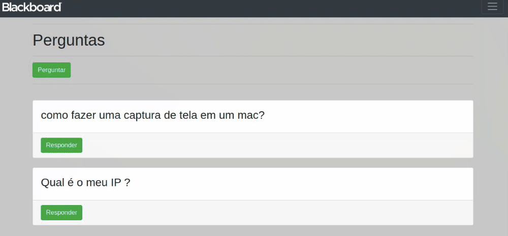
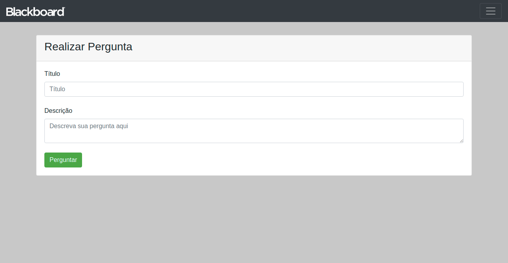

<h1 align=center>

</h1>

<h1 align="center">Blacboard Pergunta</h1>

<p align="center">O projeto foi pensado em uma ferramenta de tirar sua duvida comoutro colegas que já passaram pelo mesmo problema</p>

<h1 align="center">
    <a href="https://nodejs.org/en/">
    🔗 Node</a>
</h1>
<p align="center">🚀 O Node.js é semelhante em design e influenciado por sistemas como Ruby Event Machine e Python's Twisted .</p>

Tabela de conteúdos
=================
<!--ts-->
   * [Sobre](#Sobre)
   * [Tabela de Conteudo](#tabela-de-conteudo)
   * [Instalação](#instalacao)
   * [Como usar](#como-usar)
      * [Pre Requisitos](#pre-requisitos)
      * [Local files](#local-files)
      * [Remote files](#remote-files)
      * [Multiple files](#multiple-files)
      * [Combo](#combo)
   * [Tests](#testes)
   * [Tecnologias](#tecnologias)
<!--te-->

<h4 align="center"> 
	🚧  Perguntas 🚀 Em construção...  🚧
</h4>

### Features

- [x] Registro de perguntas
- [x] Respostas dos usuarios
- [ ] menu de busca

<h1 align="center">
  
</h1>
<br>

<h1 align="center">
  
</h1>
<br>
<h1 align="center">
  
</h1>

### Pré-requisitos

Antes de começar, você vai precisar ter instalado em sua máquina as seguintes ferramentas:
[Git](https://git-scm.com), [Node.js](https://nodejs.org/en/). 
Além disto é bom ter um editor para trabalhar com o código como [VSCode](https://code.visualstudio.com/)
Tambem o [Docker](https://docs.docker.com/get-docker) e [docker-compose](https://docs.docker.com/compose/install/).

### 🎲 Rodando o Back End (servidor)

```bash
# Clone este repositório
$ git clone <https://github.com/IgorGuariroba/Perguntas-e-respostas-.git1>

# Acesse a pasta do projeto no terminal/cmd
$ cd Perguntas-e-respostas

# E ele ira iniciar o download de todas as imagens e Instalar as dependências
$ docker-compose up 

# O servidor inciará na porta:80 - acesse <http://localhost>
```

### 🛠 Tecnologias

As seguintes ferramentas foram usadas na construção do projeto:

- [Node.js](https://nodejs.org/en/)
- [Mysql](https://www.mysql.com/)
- [Express](https://expressjs.com/pt-br/)
- [Docker](https://www.docker.com/)

## **:octocat: COMO CONTRIBUIR**
  
  - Verifique as **[Issues](https://github.com/x0n4d0/ecoleta/projects/1)** que estão abertas e se já não existe alguma com a sua feature;
  - Abra uma **Issue** com o nome e descrição da sua feature e assine com o seu usuário informando que irá fazê-la;
  - Faça um **[fork](https://help.github.com/pt/github/getting-started-with-github/fork-a-repo)** do repositório;
  - Entre no sua página do GitHub e faça um **clone** do seu **fork**;
  - Crie uma *branch* com o nome da sua feature: `git chechout -b feat/minhaFeature`;
  - Faça as alterações necessárias no código ou na documentação;
  - Instale as dependências do *commitlint* na raíz do projeto para a verificação dos commits: `npm install` ou `yarn`;
  - Faça o *commit* das suas alterações seguindo as [convenções de commit](https://www.conventionalcommits.org/pt-br/v1.0.0-beta.4/), adicione na descrição o id da sua Issue em parênteses e lembre de fechar a sua Issue com o id no rodapé do commit:

  ```
    <tipo>(escopo opcional): <descrição> (#x)

    [corpo do commit]

    Close #x
  ```
  Exemplo:
  ```sh
    feat: adicionado componente para tal coisa (#52)

    Foi adicionado um componente para tal coisa com o objetivo de melhorar tal coisa, deixando o projeto de tal maneira.

    Close #52
  ```
  - Faça um *push* para a sua *branch*: `git push origin feat/minhaFeature`;
  - Agora é só abrir um *pull request* no repositório que você fez o *fork* e assim que acontecer o *merge* sua Issue será fechada e suas alterações irão fazer parte do projeto;
  - Depois que o *merge* da sua pull request for feito, você pode deletar a sua *branch*.

  \* **Obrigado por contribuir!** ❤️ :facepunch: :blush:


## **LICENÇA**

Esse repositório está licenciado pela **MIT LICENSE**. Para mais informações detalhadas, leia o arquivo [LICENSE](./LICENSE) contido nesse repositório. 

<h3 align="center">
Feito com ❤️ por <a href="h">Igor R. Guariroba</a>
